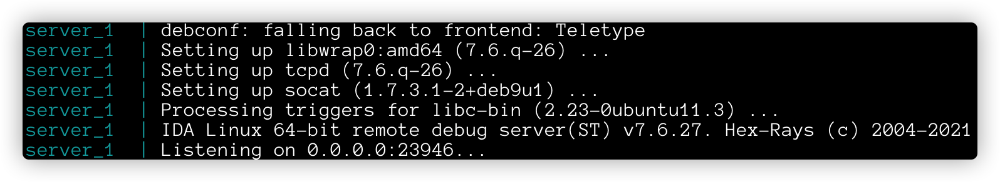
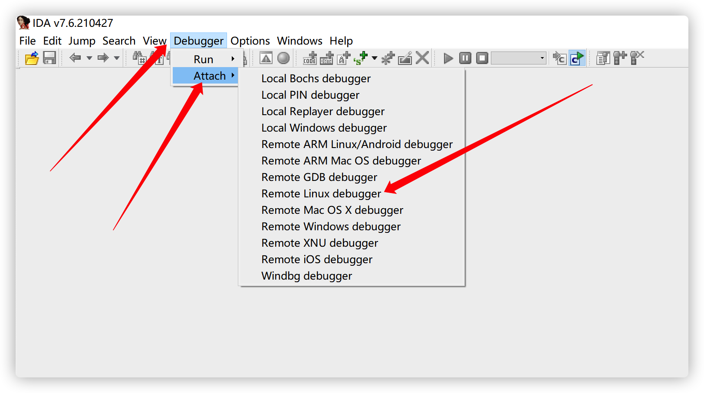
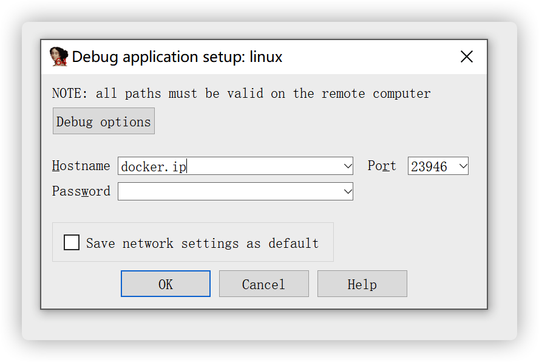
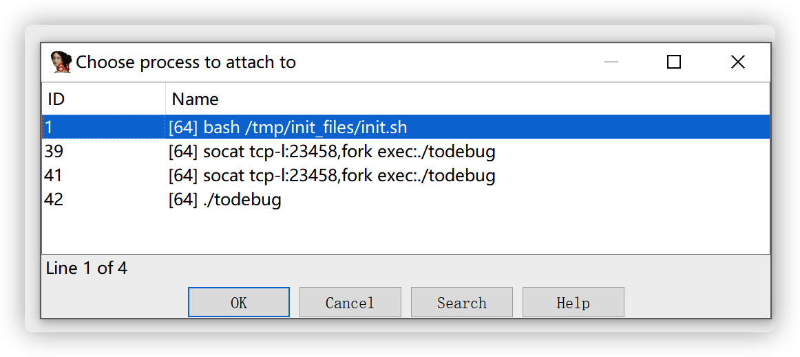

# Debug with IDA and Pwntools in Docker (DIPD)

## Get Started

1. Install docker , docker-compose and IDA (You can deloy them in separated hosts, but the network between them must be OK)
2. move the binary to `debug/` directory and rename the binary to `todebug`
3. run the command `docker-compose up` in this directory

Access to the STDIO of binary

```bash
nc docker.ip 23458
```

IDA Pro Debugger Arguments (version 7.6)

- Type: Remote Linux Debugger (Attach)
- Hostname: docker.ip (the IP of your host which running docker)
- Port: 23946
- No password  need

**Caution**

- You have to run the binary by netcat or pwntools before attaching process, or you can't see the process in your IDA
- You have to run the docker in a 64bit arch linux to support both 32bit(i386) and 64bit(amd64) debug

### Success Demo

Start the DIPD

```bash
docker-compose up
```



Run and connect to the binary stdio

```bash
nc docker.ip 23458
```

 Now, your binary should have been running

Let's use our IDA and start the IDA Debugger



Input Information and click "OK"



Now you can see the processes in your docker, choose `./todebug` and click "OK"



Now, you should have got into IDA debug view without any error and exception .

## Documents

You can see them in my blog, coming soon...

Or you can check the `docker-compose.yml` and make some modification